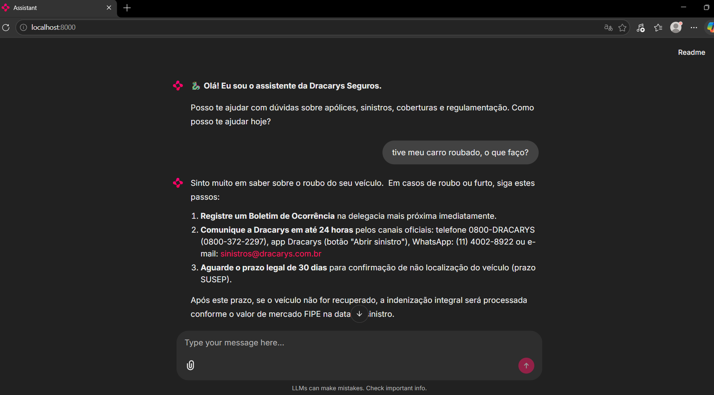

# 🐉 Dracarys — House of the RAG

> Chatbot de atendimento a segurados baseado em **LLM + RAG**, construído como entrega do Desafio 2 do curso **InsurMinds** (I2A2 Academy).


---

## ✨ O que é

Um assistente conversacional que responde dúvidas reais de segurados (sinistros, coberturas, apólice, regulamentação SUSEP) usando **Retrieval-Augmented Generation**: as respostas são ancoradas em uma base de conhecimento curada, e cada resposta cita explicitamente a fonte consultada.

Todo o stack é **open source** e roda em **infraestrutura privada** — nenhuma conversa do usuário sai pra serviço externo.

## 🎯 Demo



Exemplo real: pergunta "tive meu carro roubado, o que faço?" → resposta empática + passos numerados + citação de fonte (`faqs/01_sinistros_automovel.md`).

Ver mais em [`prints/`](prints/).

## 🏗️ Arquitetura

```
[Usuária]
   │ pergunta
   ▼
[Chainlit UI] ──── http :8000 (localhost)
   │
   ▼
[RAG Chain (LangChain)]
   │
   ├── 1. Embed da pergunta (BGE-M3, multilingual SOTA)
   ├── 2. Retrieve top-K=6 chunks (Chroma cosine similarity)
   ├── 3. Monta prompt: System + Contexto + Pergunta
   │
   ▼
[LLM gemma2:27b]  ←── SSH tunnel cifrado
   │
   ▼
[DGX Spark (GB10 Blackwell) — Ollama]
   │
   ▼
[Resposta streamada → UI + fontes citadas no footer]
```

## 🧰 Stack

| Componente | Escolha | Por quê |
|---|---|---|
| **LLM** | `gemma2:27b` via Ollama | Open source, excelente PT-BR, sem thinking-mode, instruction-tuned |
| **Embeddings** | `BAAI/bge-m3` | SOTA multilingual — crítico pra qualidade do retrieval em PT-BR |
| **Vector DB** | Chroma persistente | Zero infra extra, persistência em disco |
| **Framework** | LangChain | Alinhado com conteúdo do curso (Aula 04) |
| **UI** | Chainlit | Chat profissional, streaming, pronto pra prints |
| **Parsers** | pdfplumber + BeautifulSoup | PDFs complexos e HTML |
| **Chunking** | RecursiveCharacterTextSplitter | Separadores PT-BR (800 chars / 150 overlap) |
| **Inferência** | NVIDIA DGX Spark (GB10) | 100% GPU, ~14 tok/s no modelo 27B |

## 🚀 Como rodar

### Pré-requisitos

- Python 3.12+
- Acesso SSH a uma máquina rodando Ollama (ou Ollama local)
- Modelo `gemma2:27b` baixado no servidor Ollama

### Setup

```bash
git clone https://github.com/<seu-usuario>/chatbot-seguros-rag.git
cd chatbot-seguros-rag

# Cria venv + instala dependências
python -m venv .venv
.venv\Scripts\activate     # Windows
# source .venv/bin/activate  # Linux/Mac
pip install -r requirements.txt
```

### Ingestão da base de conhecimento

```bash
# Opcional: baixa cartilhas públicas da SUSEP
python scripts/fetch_susep.py

# Indexa todos os documentos em data/raw/ no Chroma
python ingest.py
```

A primeira execução baixa o modelo de embeddings `BAAI/bge-m3` (~2 GB) do Hugging Face.

### Tunnel SSH (se LLM estiver remoto)

```bash
ssh -L 11435:localhost:11434 -N <seu-servidor-ollama>
```

### Subir o chatbot

```bash
chainlit run app.py
```

Abre em `http://localhost:8000`.

## 📊 Resultados do eval

Conjunto de **20 perguntas** cobrindo sinistros, coberturas, apólice, regulamentação SUSEP, termos técnicos e edge cases (perguntas fora de escopo).

| Métrica | Valor |
|---|---|
| Respostas factualmente corretas | **19/20 (95%)** |
| Recusas em edge cases | **4/4 (100%)** |
| Citação de fonte | **20/20 (100%)** |
| Tempo médio de resposta | ~9s |
| Throughput | 13,7 tok/s (gemma2:27b em GB10) |

Resultados completos em [`tests/eval_results.md`](tests/eval_results.md).

## 📁 Estrutura do projeto

```
chatbot-seguros-rag/
├── app.py                  # Chainlit UI (entrypoint)
├── ingest.py               # Pipeline: parse → chunk → embed → Chroma
├── rag.py                  # RAG chain (retrieval + LLM)
├── llm.py                  # Cliente Ollama
├── config.py               # Configurações centralizadas
├── prompts.py              # System prompts (insurance persona)
├── chainlit.md             # Mensagem de boas-vindas do chat
├── data/raw/
│   ├── faqs/               # FAQs sintéticas (6 documentos)
│   └── susep/              # Cartilhas SUSEP (após fetch_susep.py)
├── tests/
│   ├── eval_questions.json # 20 perguntas de teste
│   ├── eval.py             # Script de avaliação
│   └── eval_results.md     # Resultados completos
├── scripts/
│   ├── fetch_susep.py      # Baixa cartilhas SUSEP públicas
│   ├── md_to_pdf.py        # Conversor MD → PDF (via Edge headless)
│   └── make_zip.py         # Empacotamento para entrega
├── prints/                 # Screenshots da execução
├── prompts.md              # Documentação dos prompts
├── relatorio-final.md      # Relatório técnico completo
└── requirements.txt
```

## 🧠 Decisões de design

### Por que gemma2:27b e não qwen2.5:72b?
72B daria ~2-3 tok/s a mais de qualidade marginal mas ocuparia 45 GB de download. 27B já cabe em ~15 GB e roda 100% GPU no Spark, dando tempos médios de 9s por resposta.

### Por que BGE-M3?
Pra português brasileiro, é o melhor embedding multilingual open source disponível (testado em benchmarks MIRACL e MKQA). E como roda local, não precisa de OpenAI Embeddings.

### Por que Chroma e não Qdrant/Pinecone?
3 dias de prazo. Chroma persistente em disco resolve sem servidor extra. Pra produção, Qdrant ou pgvector seriam melhores escolhas.

### Por que tunnel SSH ao invés de API key remota?
Privacidade. Conversas com o chatbot não saem do tunnel cifrado — nem o Ollama do servidor remoto loga nada externamente.

### O que ficou de fora?
- **Reranker** (`bge-reranker-v2-m3`) — daria +15% de precisão, mas a chain básica já bateu 95%.
- **LLM-as-a-judge** pra eval automatizado — substituí por eval manual com 20 perguntas categorizadas.
- **Multi-turn conversation memory** — cada pergunta é stateless. Pra um FAQ-bot, isso é até desejável.

## 🔮 Próximos passos

- [ ] Reranker pra ganho marginal de precisão
- [ ] Integração com WhatsApp Business API
- [ ] Cache semântico de respostas frequentes
- [ ] Feedback loop (👍/👎) pra melhoria contínua
- [ ] Métricas de produção (latência p50/p99, taxa de "não encontrei")
- [ ] LLM-as-a-judge pra eval contínuo

## ⚠️ Aviso

Este projeto é uma **prova de conceito acadêmica**. As FAQs incluídas são sintéticas e referenciam uma seguradora fictícia chamada "Dracarys". **Não use as informações como aconselhamento real sobre seguros** — consulte sempre uma seguradora autorizada pela SUSEP.

## 📚 Contexto acadêmico

Entrega do **Desafio 2 — "Vamos Conversar?"** do curso InsurMinds (I2A2 Academy — Turma 1 / 2026), aula 04 ("Agentes Inteligentes com Redes Generativas — RAG").

- **Grupo:** Dracarys — House of the RAG (entrega individual)
- **Integrante:** Kamila Silva Pantoja
- **E-mail:** kms.pantoja@gmail.com

Relatório completo em [`relatorio-final.md`](relatorio-final.md).
